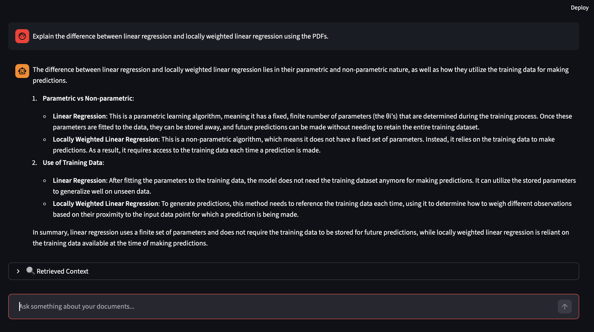
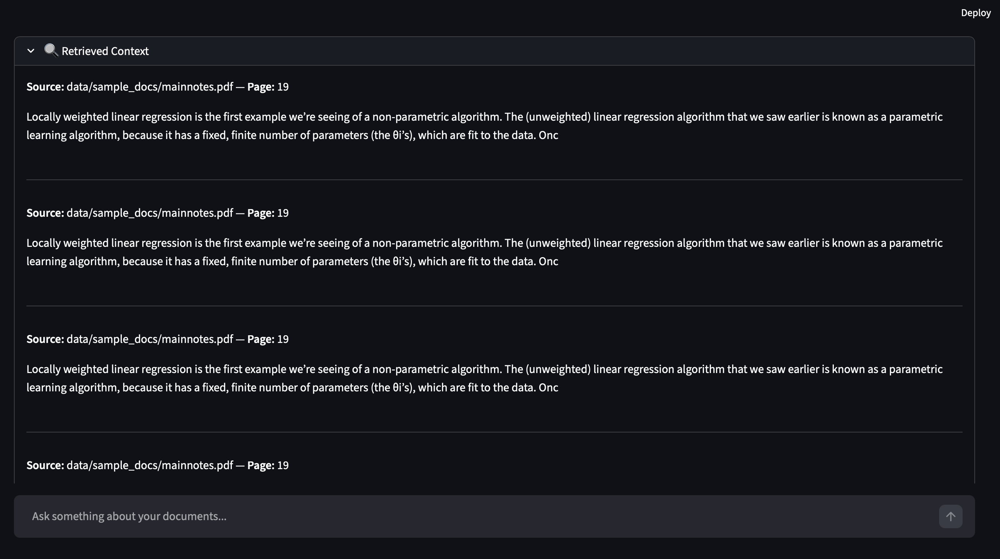

# ⭐ enterprise-ai-agent
### A production‑grade AI Agent with RAG, streaming, LangGraph workflow, and a clean Streamlit UI.

This project demonstrates how to build a real-world enterprise AI system using:

- Retrieval-Augmented Generation (RAG)
- LangGraph workflow orchestration
- FastAPI backend with streaming
- Streamlit chat UI
- Document ingestion + page‑level citations
- OpenAI-compatible LLMs

It’s designed to look and feel like a professional, production-ready AI assistant — the kind companies hire engineers to build.

---

## 🚀 Demo (Local)

Run the backend:

```bash
uvicorn app:app --reload
```
Run the UI:

```bash
streamlit run ui/app.py
```
Then open the browser and chat with your documents.

🧠 Features

✅ Retrieval-Augmented Generation (RAG)

Ingests PDFs and extracts text

Retrieves the most relevant chunks

Provides page‑level citations

Shows source + snippet in the UI

✅ Streaming Responses (ChatGPT‑style)

FastAPI streams tokens

UI updates in real time

Smooth, modern chat experience

✅ LangGraph Workflow

Modular agent pipeline

Nodes for retrieval + LLM

Easy to extend with more tools

✅ Clean Streamlit Chat UI

Chat bubbles

Context expander

Persistent chat history

✅ Enterprise‑grade structure

Clear folder layout

Separation of backend, agent, and UI

Easy to deploy

🏗️ Architecture

High-level flow

Code

User → Streamlit UI → FastAPI → LangGraph Agent → Retriever → LLM → Streamed Response → UI

### Mermaid Diagram

```mermaid
flowchart TD
    A[User Question] --> B[Streamlit UI]
    B --> C[FastAPI /ask Endpoint]
    C --> D[LangGraph Workflow]
    D --> E[Retriever Node]
    E --> F[LLM Node]
    F --> G[Final Answer + Context]
    G --> H[StreamingResponse]
    H --> B


## 🔧**Project Structure**  

```markdown
```text
enterprise-ai-agent/
│
├── agent/
│   ├── graph.py          # LangGraph workflow
│   ├── rag.py            # Retriever + embeddings
│
├── data/
│   └── sample_docs/      # PDFs for RAG
│
├── ui/
│   └── app.py            # Streamlit chat UI
│
├── app.py                # FastAPI backend (streaming)
├── requirements.txt
└── README.md

🔍 How It Works

1. User asks a question

    The UI sends the question to the FastAPI backend.

2. LangGraph pipeline runs

    Retrieve relevant PDF chunks

    Build context

    Generate an answer

3. FastAPI streams the answer

    The LLM output is streamed token-by-token.

4. UI displays the answer in real time

    Just like ChatGPT.

5. Context is shown with page numbers

    This proves your RAG is real and trustworthy.

## 📸 Screenshots 
### Chat Interface 
 
### Retrieved Context 


```markdown
## 🛠️ Tech Stack 
| Layer      | Technology                      | 
|------------|---------------------------------| 
| Backend    | FastAPI                         | 
| UI         | Streamlit                       |  
| Workflow   | LangGraph                       | 
| LLM        | OpenAI-compatible (gpt-4o-mini) | 
| Retrieval  | LangChain + embeddings          | 
| Storage    | Local PDFs                      | 
| Streaming  | FastAPI SSE + httpx             |
 
⭐ Why This Project Stands Out

This project demonstrates real AI engineering skills:

Multi-step agent design

RAG with citations

Streaming architecture

Clean UI + backend separation

LangGraph workflow orchestration

Production-ready structure

This is the kind of project that gets interviews.

💼 Resume Bullet Points

AI/ML Engineer — enterprise-ai-agent (Personal Project)

Built a production-grade AI agent using LangGraph, FastAPI, and Streamlit, enabling multi-step reasoning and modular workflow orchestration.

Implemented Retrieval-Augmented Generation (RAG) with page-level citations using PDF ingestion, embeddings, and vector search.

Developed a real-time streaming pipeline using FastAPI SSE + httpx for ChatGPT-style token streaming.

Designed a clean, user-friendly chat interface with context visualization and persistent chat history.

Engineered a scalable architecture separating backend, agent logic, and UI for enterprise-ready deployment.

📦 Installation

bash

git clone https://github.com/Snehitha-815/enterprise-ai-agent

cd enterprise-ai-agent

pip install -r requirements.txt

🔮 Future Enhancements

Chat history in backend

Multi-agent workflows

Tool-calling (calculator, search, SQL)

Cloud deployment (Render / Azure)

Authentication + user sessions

❤️ Author
Snehitha Reddy  
AI/ML Engineer — specializing in RAG, LangGraph, LLMs, and production AI systems.
